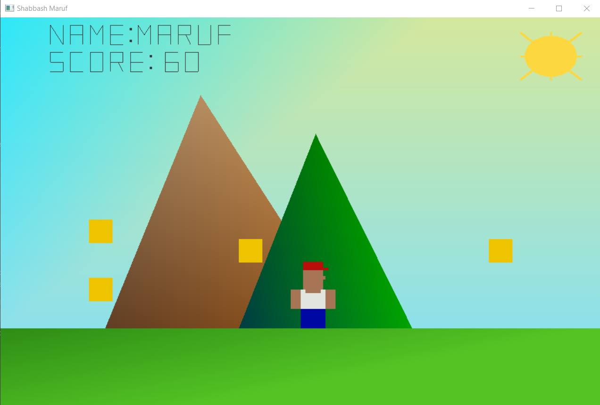

# Shabbash Maruf: A 2D platformer game

### Description
Shabbash Maruf is a 2D platformer game, inspired by the Game "Mario Go!" where the player moves a character named Maruf across a fixed environment, with the objective of getting it to collect coins. 

This was a group project, developed using python OPEN GL library, and was made as a requriement for the completion of the course CSE423 [Computer Graphics].

### Requirements
1. Numpy library
1. Open GL library
1. Open GL, GLUT library
1. Open GL, GLU library

### Components:
1. Background: The sky and the ground have been made using OpenGL quad shapes, two mountains have been generated with OpenGL triangles, and the sun has been drawn in the top right corner using the midpoint circle algorithm and filled in using the midpoint line drawing algorithm.

1. Character (Maruf): This has been made using multiple OpenGL quad shapes. Its coordinates are added with a translation matrix to show movement on the x and y plane. 

1. Name display and score counter:  All displayed text has been written using OpenGL lines and/or OpenGL points. 

1. Random Coin management: It is made using simple logic, Random function, and OpenGL points (as project requirement specified to not use more than one circle).

### User inputs:
1. Text input: Before the game is launched, the user is prompted to enter their name in the text box.
  Once the name has been inputted, it displays the first 5 characters just above the score, as shown in the image above. 
 Additionally, to move Maruf across the screen, the player uses Left and Right arrow keys which allows horizontal movement. It has been implemented using the glutSpecialFunc function in the OpenGL.GLUT library.  

2. Spacebar: helps to jump up so that Maruf can collect coins that are higher up on the screen. This has been done with the glutKeyboardFunc() and glutKeyboardUpFunc() functions in the OpenGL.GLUT library.

### All structures used (Based on project requirements directed by the course):
1. Transformations used: Translation (Maruf movement)
1. Mid-point line drawing algorithm (sun fill)
1. Mid-point circle drawing algorithm (sun border)
1. OpenGL Library defined shapes used: Quads, Triangle, Lines, Points 

### Contributers
1. [Sanji-chan](https://github.com/Sanji-chan) [background, score board, coin management (generation, catch, score update)]
1. [namiallstars](https://github.com/namiallstars) [character design and movement] 
1. Khandaker Maisha Tanzim [sun]